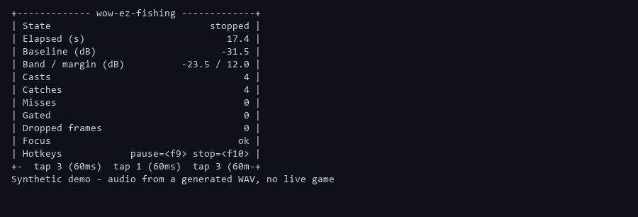

# ez-wow-fishing

A driverless, sound-driven auto-fishing bot for World of Warcraft. It listens to your
system's own audio output through WASAPI loopback capture, picks out the fishing-bobber
splash with an FFT band-energy onset detector that auto-calibrates to your ambient noise,
and reacts with scan-code keyboard input. No virtual audio cable, no driver install.
No memory reading, no packet manipulation: audio in, keystrokes out.



## Legal & fair use

**Automating gameplay violates Blizzard's End User License Agreement (EULA) and Terms
of Service, and can get your account permanently banned.** This project is published for
educational purposes: real-time digital signal processing, WASAPI loopback capture, and
Windows input injection. It is a portfolio piece demonstrating those techniques, not a
recommendation to use it against a live account you care about.

The bot's design is intentionally narrow in what it touches:

- It reads **only** the system's audio output (loopback capture and, optionally, a
  per-process volume peak). It never reads game memory.
- It writes **only** synthetic keystrokes (scan-code key taps). It never injects code
  into the game process.
- It never inspects or manipulates network packets.
- It never touches game files.

Use it at your own risk, on your own account, understanding the consequences.

## Install

```bash
uv sync
uv run ez-wow-fishing doctor
```

`doctor` checks your Python version, WASAPI availability, loopback device resolution,
whether a `Wow.exe` audio session is visible, and whether the input libraries imported
correctly. On Windows it also warns if the bot is not running elevated while the game is.

## Quickstart

```bash
uv run ez-wow-fishing calibrate --seconds 5
cp config.example.toml config.toml
# edit config.toml with the band and margin calibrate suggested
uv run ez-wow-fishing run --dry-run
uv run ez-wow-fishing run
```

`--dry-run` runs the full pipeline (capture, detection, state machine) but prints the
keys it would have pressed instead of sending them, so you can verify detection and
timing safely before letting it touch the game.

## Configuration

Copy `config.example.toml` to `config.toml` (gitignored) and edit it; every key has a
comment describing its effect. CLI flags on `run` override the file, which overrides
these defaults.

| Section | Key | Default | Meaning |
|---|---|---|---|
| audio | backend | `hybrid` | `hybrid` (FFT + per-process gate), `loopback` (FFT only), `session_meter` (per-process peak only) |
| audio | device_name | `""` | Substring match on a loopback device name; empty = default speakers |
| audio | sample_rate | `0` | 0 = use the device's own sample rate |
| audio | frame_size | `1024` | PortAudio callback buffer size, in frames |
| audio | queue_frames | `64` | Bounded queue depth between the callback and the detector |
| audio | process_name | `Wow.exe` | Process whose audio session pycaw meters |
| audio | session_gate_peak | `0.05` | Minimum pycaw peak (0..1) treated as "the game made sound" |
| audio | session_poll_hz | `20` | Session meter poll rate |
| detection | band_low_hz | `500.0` | Lower edge of the splash frequency band |
| detection | band_high_hz | `4000.0` | Upper edge of the splash frequency band |
| detection | window_size | `2048` | FFT analysis window size, in samples |
| detection | hop_size | `1024` | Samples advanced between analysis frames |
| detection | calibration_seconds | `3.0` | Ambient audio collected before priming the baseline |
| detection | trigger_margin_db | `12.0` | dB above baseline required to consider a frame a candidate |
| detection | onset_db | `6.0` | Required rise over the recent lookback to call it an onset |
| detection | onset_lookback_frames | `4` | Recent frames the onset flux compares against |
| detection | min_event_frames | `2` | Consecutive qualifying frames required to fire |
| detection | refractory_s | `3.0` | Minimum time between two fired events |
| detection | baseline_alpha | `0.02` | EWMA smoothing factor for the ambient baseline |
| detection | baseline_freeze_margin_db | `6.0` | Baseline stops adapting this many dB above itself |
| input | cast_key | `1` | Keybind used to cast the fishing ability |
| input | loot_key | `3` | Keybind used to interact with the bobber / loot |
| input | key_hold_ms | `60` | How long a key is held down |
| input | loot_delay_ms | `120` | Delay before the loot key press |
| input | cast_to_arm_s | `1.5` | Time after casting before splash detection starts listening |
| input | post_loot_s | `1.2` | Pause after looting before the next cast |
| input | recast_delay_s | `0.8` | Pause between idle and the next cast |
| input | jitter_ms | `80` | Random extra delay added to presses |
| input | rng_seed | `0` | 0 = nondeterministic; tests set a fixed seed |
| bot | max_wait_s | `25.0` | Seconds to wait for a bite before giving up |
| bot | require_focus | `true` | Only send input while the game window is focused |
| bot | window_title_contains | `World of Warcraft` | Substring the foreground window title must contain |
| bot | max_casts | `0` | Stop after this many casts; 0 = unlimited |
| bot | stop_after_minutes | `0` | Stop after this many minutes; 0 = unlimited |
| hotkeys | pause | `<f9>` | Pause/resume hotkey |
| hotkeys | stop | `<f10>` | Stop hotkey |
| ui | refresh_hz | `8` | Console status panel refresh rate |
| ui | log_file | `""` | Optional path to also write logs to a file |
| ui | color | `true` | Enable rich color output |

## How detection works

Audio is analyzed in overlapping FFT windows; the energy inside a configurable frequency
band is tracked in dB against a slowly-adapting ambient baseline. A splash is an *onset*:
a fast rise (`onset_db`) above a recent lookback, sustained above the baseline by
`trigger_margin_db` for `min_event_frames` frames, gated by a `refractory_s` cooldown so
one splash cannot fire twice. See [docs/detection.md](docs/detection.md) for the full
algorithm and how to tune it from `calibrate` output.

## Threading model

```
 WASAPI loopback callback (PortAudio thread)
        │  int16 -> float32, downmix, queue.put_nowait
        ▼
 bounded queue.Queue(maxsize=queue_frames)
        │  queue.get(timeout=...)
        ▼
 detector thread (state machine "tick")  ───────────────►  SplashDetector.push()
        │  DetectionEvent list                                     │
        ▼                                                          │
 FishingBot state machine (main thread)  ◄───── SessionMeter (own thread, pycaw poll)
        │
        ▼
 Actions -> Keyboard (DirectInputKeyboard / DryRunKeyboard)
```

The PortAudio callback never blocks and never does DSP; it only downmixes and enqueues.
If the queue fills (the state machine falls behind), the oldest frame is dropped and
`dropped_frames` increments rather than growing memory unbounded. The `SessionMeter`
polls `pycaw` on its own background thread and only ever hands over the max recent peak.

## Troubleshooting

- **No loopback device found** — run `ez-wow-fishing devices`. On Windows 10/11, WASAPI
  loopback works on the default output device with no driver; see
  [docs/audio-setup.md](docs/audio-setup.md).
- **Keys are ignored by the game** — WoW may be running elevated. Run the bot elevated
  too; `doctor` detects and reports this.
- **False positives from Discord, Spotify, or a browser tab** — those all land in the
  same loopback stream as the game. Use `backend = "hybrid"` (the default) so a splash
  must also show up in the game's own audio session, and narrow `band_low_hz` /
  `band_high_hz` with `calibrate`.

## Development

```bash
uv run ruff check .
uv run ruff format --check .
uv run pytest -q
```

All tests are synthetic (generated waveforms and fakes); none open a real audio device
or network socket, so the suite runs the same on Linux CI and on Windows.
